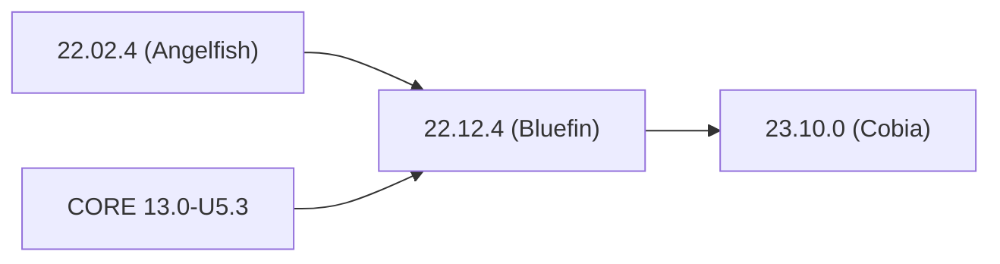




This page is being rebuilt with notes from the latest TrueNAS CORE **nightly** development versions.
The latest [TrueNAS CORE **stable** version release notes](https://www.truenas.com/docs/core/13.0/gettingstarted/corereleasenotes/) are now available from the TrueCommand 2.3 section of the Documentation Hub.


<!-- Comment out until rebuild is done.
## Obtaining a Release

Log in to the web interface and go to **System Settings > Update** to see an option to switch to the **** update train and begin downloading the latest BETA release.

Alternately, to download an <file>.iso</file> file or <file>.update</file> for installing or upgrading to SCALE 23.10-BETA.1 (Cobia), go to https://www.truenas.com/truenas-scale/ and click **Download**.
More details are available from [23.10 Upgrades]()







| Version | Checkpoint | Scheduled Date |
|---------|------------|----------------|
| SCALE 23.10-RC.1 (Cobia) | Code-freeze | 30 August 2023 |
|                          | Internal Testing Sprints | 4 September - 15 September 2023 |
|                          | Tag | 18 September 2023 |
|                          | **Release** | **19 September 2023** |
| SCALE 23.10.0 (Cobia) | Code-freeze | 4 October 2023 |
|                       | Internal Testing Sprints | 9 October - 20 October 2023
|                       | Tag | 23 October 2023 |
|                       | **Release** | **24 October 2023** |
| SCALE 23.10.1 (Cobia) | Code-freeze | 29 November 2023 |
|                       | Internal Testing Sprints | 4 December - 15 December 2023 |
|                       | Tag | 18 December 2023 |
|                       | **Release** | **19 December 2023** |



## Upgrade Notes

### Upgrade Paths (Anticipated)

See the <a href="https://www.truenas.com/software-status/" target="_blank">TrueNAS Software Status</a> page for recommendations about which software version to use based on your user type.

Update the system to the latest maintenance release of the installed major version before attempting to upgrade to a new TrueNAS SCALE major version.


System configuration files generated from releases before **22.12.4 (Bluefin)** are not compatible with 23.10 (Cobia).
When available, update the system to **22.12.4 (Bluefin)**, resolve any migrations from deprecated services to replacement apps, and download a fresh system configuration file before attempting to upgrade.



Migrations from TrueNAS CORE for Enterprise High Availability (HA) systems are not recommended at this time.



**TrueNAS SCALE**

<--->
**TrueNAS SCALE Enterprise**



## Component Versions
Click the component version number to see the latest release notes for that component.
<table class="truetable" style="width:25%;">
  <tr>
    <th>Component</th>
	<th>Version</th>
  </tr>
  <tr>
    <td>FreeBSD Version</td><td><a href="https://git.kernel.org/pub/scm/linux/kernel/git/stable/linux.git/tag/?h=v6.1.42">6.1.42</a></td>
  </tr>
  <tr>
	<td>Nvidia Driver</td><td><a href="https://docs.nvidia.com/datacenter/tesla/pdf/NVIDIA_Data_Center_GPU_Driver_Release_Notes_535_v1.0.pdf">535.54.03-2</a></td>
  </tr>
  <tr>
	<td>OpenZFS</td><td><a href="https://github.com/openzfs/zfs/releases/tag/zfs-2.2.0-rc1">2.2.0</a></td>
  </tr>
</table>

### New OpenZFS Feature Flags
The items listed here represent new feature flags implemented since the previous update to the built-in OpenZFS version (2.1.11).


| Feature Flag | GUID | Notes |
|--------------|------|-------|
| blake3 | [org.openzfs:blake3](https://openzfs.github.io/openzfs-docs/man/master/7/zpool-features.7.html#org.openzfs:blake3) | |
| block_cloning | [com.fudosecurity:block_cloning](https://openzfs.github.io/openzfs-docs/man/master/7/zpool-features.7.html#com.fudosecurity:block_cloning) | This is enabled by default for pools created in 23.10 (Cobia). Systems upgrading to 23.10 have to upgrade existing pools to enable this feature. |
| draid | [org.openzfs:draid](https://openzfs.github.io/openzfs-docs/man/master/7/zpool-features.7.html#org.openzfs:draid) | Web interface support is not present in 23.10-BETA.1. |
| head_errlog | [com.delphix:head_errlog](https://openzfs.github.io/openzfs-docs/man/master/7/zpool-features.7.html#com.delphix:head_errlog) | |
| vdev_zaps_v2 | [com.klarasystems:vdev_zaps_v2](https://openzfs.github.io/openzfs-docs/man/master/7/zpool-features.7.html#com.klarasystems:vdev_zaps_v2) | |
| zilsaxattr | [org.openzfs:zilsaxattr](https://openzfs.github.io/openzfs-docs/man/master/7/zpool-features.7.html#org.openzfs:zilsaxattr) | Web interface support is not present in 23.10-BETA.1. |


For more details on feature flags see [OpenZFS Feature Flags](https://openzfs.github.io/openzfs-docs/Basic%20Concepts/Feature%20Flags.html).
For more details on zpool.features.7 see [OpenZFS zpool-feature.7](https://openzfs.github.io/openzfs-docs/man/7/zpool-features.7.html).

## Major Version BETA.1 Changelog

Early releases are intended for testing and early feedback purposes only.
Do not use early release software for critical tasks.

**Day Month, Year**
iXsystems is pleased to release <MAJOR VERSION NAME (NICKNAME)>!

Notable changes:

* The advanced **Auxiliary Parameters** field is removed from both **Shares > SMB > Add** and **System Settings > Services > SMB** screens ([NAS-120530](https://ixsystems.atlassian.net/browse/NAS-120530)). Previously configured auxiliary parameters do remain on upgrade, but further changes must be done through CLI or API.
* As part of the system reporting and debug improvements, system logs now exclusively write to the TrueNAS boot device.

<a href="https://ixsystems.atlassian.net/issues/?filter=10359&atlOrigin=eyJpIjoiNTczY2E2NmVjODk5NGE0NThlZTFlOTI4MDFhOTMzNzUiLCJwIjoiaiJ9" target="_blank">Click here for the full changelog</a> of completed tickets that are included in the 23.10-BETA.1 release.
To switch between detail and list views for the changelog, press `t`.
Open the changelog in Jira to see the  **Export** menu to print or download the changelog in various file formats.

### Major Version BETA.1 Ongoing Issues
-->