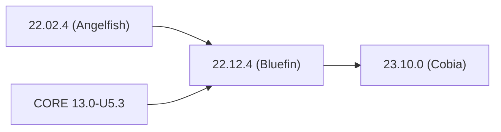



## Obtaining a Release

Log in to the web interface and go to **System Settings > Update** to see an option to switch to the **TrueNAS-SCALE-Cobia-BETA** update train and begin downloading the latest BETA release.

Alternately, to download an <file>.iso</file> file or <file>.update</file> for installing or upgrading to SCALE 23.10-BETA.1 (Cobia), go to https://www.truenas.com/truenas-scale/ and click **Download**.
More details are available from [23.10 Upgrades]().







| Version | Checkpoint | Scheduled Date |
|---------|------------|----------------|
| SCALE 23.10.0 (Cobia) | Code-freeze | 4 October 2023 |
|                       | Internal Testing Sprints | 9 October - 20 October 2023
|                       | Tag | 23 October 2023 |
|                       | **Release** | **24 October 2023** |
| SCALE 23.10.1 (Cobia) | Code-freeze | 29 November 2023 |
|                       | Internal Testing Sprints | 4 December - 15 December 2023 |
|                       | Tag | 18 December 2023 |
|                       | **Release** | **19 December 2023** |



## SCALE 23.10 (Cobia) Primary Features



## Upgrade Notes

* Several built-in services from SCALE 22.12 (Bluefin) or TrueNAS CORE 13.0 in **System Settings > Services** are replaced by community applications.
  You must disable these built-in services and begin using the equivalent application **before** upgrading to SCALE 23.10 (Cobia).

  
  TrueNAS SCALE Enterprise customers with TrueNAS SCALE 22.12.3 (Bluefin) or later deployed are warned when a deprecated service is in use.
  To prevent any loss of service, customers with Silver or Gold level support contracts with iXsystems are prevented from upgrading to TrueNAS SCALE 23.10 (Cobia) until the deprecated services are addressed.
  

  
  
  * Dynamic DNS replaced by **[ddns-updater]()**
  * OpenVPN Server replaced by multiple VPN [apps]()
  * OpenVPN Client has no equivalent application.
  * Rsyncd Server replaced by **[rsyncd]()**
  <--->
  * S3 replaced by **[minio]()**.
  * WebDAV replaced by **[webdav]()**
  * TFTP replaced by **[tftpd-hpa]()**
  
  
  
  Due to [Minio's filesystem mode deprecation](https://min.io/docs/minio/container/operations/install-deploy-manage/migrate-fs-gateway.html) and update methodology, older versions of Minio are not updatable to newer versions and require additional update steps.
  This impacts moving from the built-in **S3** service to the **Minio** application.
  A detailed TrueNAS-specific tutorial for moving configuration and storage data from the built-in **S3** service to the latest **Minio** version available from the Community App Catalog is forthcoming.
  
  

* TrueNAS SCALE is an appliance built from specific Linux packages.
  Attempting to update SCALE with `apt` or methods other than the SCALE web interface can result in a nonfunctional system.

* All auxiliary parameters can change between TrueNAS major versions due to security and development changes.
  We recommend removing all auxiliary parameters from TrueNAS configurations before upgrading.

* Systems with large numbers of attached disks are recommended to use the [new Pool Creation wizard]() when creating or modifying a pool.

* New OpenZFS feature flags are available in this release.
  Storage pools created in previous TrueNAS SCALE versions can upgrade to enable the new feature flags.

  
  
  

* TrueCommand support for TrueNAS SCALE 23.10 (Cobia) system connections is anticipated in the TrueCommand 3.0 release.

### Upgrade Paths

See the <a href="https://www.truenas.com/software-status/" target="_blank">TrueNAS Software Status</a> page for recommendations about which software version to use based on your user type.

Update the system to the latest maintenance release of the installed major version before attempting to upgrade to a new TrueNAS SCALE major version.


System configuration files generated from releases before **22.12.4 (Bluefin)** are not compatible with 23.10 (Cobia).
When available, update the system to **22.12.4 (Bluefin)**, resolve any migrations from deprecated services to replacement apps, and download a fresh system configuration file before attempting to upgrade.


If attempting to migrate from TrueNAS CORE, see the [Migration section]() for cautions and notes about differences between each software and the CORE to SCALE migration process.


Migrations from TrueNAS CORE for Enterprise High Availability (HA) systems are not recommended at this time.



**TrueNAS SCALE**

<--->
**TrueNAS SCALE Enterprise**



## Component Versions
Click the component version number to see the latest release notes for that component.
<table class="truetable" style="width:25%;">
  <tr>
    <th>Component</th>
	<th>Version</th>
  </tr>
  <tr>
    <td>Linux Kernel</td><td><a href="https://git.kernel.org/pub/scm/linux/kernel/git/stable/linux.git/tag/?h=v6.1.42">6.1.42</a></td>
  </tr>
  <tr>
	<td>Nvidia Driver</td><td><a href="https://docs.nvidia.com/datacenter/tesla/pdf/NVIDIA_Data_Center_GPU_Driver_Release_Notes_535_v1.0.pdf">535.54.03-2</a></td>
  </tr>
  <tr>
	<td>OpenZFS</td><td><a href="https://github.com/openzfs/zfs/releases/tag/zfs-2.2.0-rc1">2.2.0</a></td>
  </tr>
</table>

### New OpenZFS Feature Flags
The items listed here represent new feature flags implemented since the previous update to the built-in OpenZFS version (2.1.11).


| Feature Flag | GUID | Notes |
|--------------|------|-------|
| blake3 | [org.openzfs:blake3](https://openzfs.github.io/openzfs-docs/man/master/7/zpool-features.7.html#org.openzfs:blake3) | |
| block_cloning | [com.fudosecurity:block_cloning](https://openzfs.github.io/openzfs-docs/man/master/7/zpool-features.7.html#com.fudosecurity:block_cloning) | This is enabled by default for pools created in 23.10 (Cobia). Systems upgrading to 23.10 have to upgrade existing pools to enable this feature. |
| draid | [org.openzfs:draid](https://openzfs.github.io/openzfs-docs/man/master/7/zpool-features.7.html#org.openzfs:draid) | Web interface support is not present in 23.10-BETA.1. |
| head_errlog | [com.delphix:head_errlog](https://openzfs.github.io/openzfs-docs/man/master/7/zpool-features.7.html#com.delphix:head_errlog) | |
| vdev_zaps_v2 | [com.klarasystems:vdev_zaps_v2](https://openzfs.github.io/openzfs-docs/man/master/7/zpool-features.7.html#com.klarasystems:vdev_zaps_v2) | |
| zilsaxattr | [org.openzfs:zilsaxattr](https://openzfs.github.io/openzfs-docs/man/master/7/zpool-features.7.html#org.openzfs:zilsaxattr) | Web interface support is not present in 23.10-BETA.1. |


For more details on feature flags see [OpenZFS Feature Flags](https://openzfs.github.io/openzfs-docs/Basic%20Concepts/Feature%20Flags.html).
For more details on zpool.features.7 see [OpenZFS zpool-feature.7](https://openzfs.github.io/openzfs-docs/man/7/zpool-features.7.html).

## 23.10.0 Changelog

**October 24, 2023**

iXsystems is pleased to release TrueNAS SCALE 23.10.0!

Notable changes:

* 
* The **Reports Config** form is removed from the **Reporting** screen [NAS-124345](https://ixsystems.atlassian.net/browse/NAS-124345)
* Improved LZ4 and ZSTD decompression algorithms are introduced and are forward and backward compatible.
  Take care if ZFS deduplication is enabled as moving between compressor versions can cause the same source data to produce different checksums, resulting in duplicate records and additional disk space consumption.
* 

<a href="https://ixsystems.atlassian.net/issues/?filter=10398" target="_blank">Click here for the full changelog</a> of completed tickets that are included in the 23.10.0 release.


### 23.10.0 Ongoing Issues

Notes:

* 

<a href="https://ixsystems.atlassian.net/issues/?filter=10399" target="_blank">Click here to see the latest information</a> about issues discovered in 23.10.0 that are being resolved in a future TrueNAS SCALE release.

## 23.10-RC.1 Changelog



Early releases are intended for testing and early feedback purposes only.
Do not use early release software for critical tasks.


**September 19, 2023**

Notable changes:

* The legacy pool creation screens are removed and the new pool creation wizard is the primary UI screen for creating new storage pools [NAS-123697](https://ixsystems.atlassian.net/browse/NAS-123697)
* **Apps > Settings** adds the **Manager Container Images** option for downloading, updating, or deleting specific container images from TrueNAS.
* Web interface feedback buttons are visible for community feedback on early releases.
* As part of the netdata implementation and overhaul of the reporting features, Graphite support is no longer built-in with TrueNAS SCALE 23.10 (Cobia) [NAS-123862](https://ixsystems.atlassian.net/browse/NAS-123862).
* Fix for the UPS service to allow device detection  [NAS-123625](https://ixsystems.atlassian.net/browse/NAS-123625)

<a href="https://ixsystems.atlassian.net/issues/?filter=10379" target="_blank">Click here for the full changelog</a> of completed tickets that are included in the 23.10-RC.1 release.
To switch between detail and list views for the changelog, press `t`.
Open the changelog in Jira to see the  **Export** menu to print or download the changelog in various file formats.

### 23.10-RC.1 Ongoing Issues

Notes:

* VMs created in previous SCALE versions with a legacy BIOS enabled can lose the **Display** button in 23.10-RC.1.
  When encountered, reconfigure the VM to use a UEFI BIOS to re-enable the **Display** button ([NAS-124296](https://ixsystems.atlassian.net/browse/NAS-124296)).

<a href="https://ixsystems.atlassian.net/issues/?filter=10380" target="_blank">Click here to see the latest information</a> about issues discovered in 23.10-RC.1 that are being resolved in a future TrueNAS SCALE release.


## 23.10-BETA.1 Changelog



Early releases are intended for testing and early feedback purposes only.
Do not use early release software for critical tasks.

**August 15, 2023**



Other notable changes:

* The advanced **Auxiliary Parameters** field is removed from both **Shares > SMB > Add** and **System Settings > Services > SMB** screens ([NAS-120530](https://ixsystems.atlassian.net/browse/NAS-120530)). Previously configured auxiliary parameters do remain on upgrade, but further changes must be done through CLI or API.
* As part of the system reporting and debug improvements, system logs now exclusively write to the TrueNAS boot device.

<a href="https://ixsystems.atlassian.net/issues/?filter=10359&atlOrigin=eyJpIjoiNTczY2E2NmVjODk5NGE0NThlZTFlOTI4MDFhOTMzNzUiLCJwIjoiaiJ9" target="_blank">Click here for the full changelog</a> of completed tickets that are included in the 23.10-BETA.1 release.
To switch between detail and list views for the changelog, press `t`.
Open the changelog in Jira to see the  **Export** menu to print or download the changelog in various file formats.

### 23.10-BETA.1 Ongoing Issues

<a href="https://ixsystems.atlassian.net/issues/?filter=10361&atlOrigin=eyJpIjoiN2ExNTQ5YmE0NmNkNGQyN2FiMTJmYmJlOWIwZWI0ZjIiLCJwIjoiaiJ9" target="_blank">Click here to see the latest information</a> about issues discovered in 23.10-BETA.1 that are being resolved in a future TrueNAS SCALE release.

