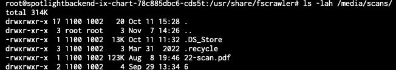



This is a fast spun up tutorial to demonstrate how to have a Samba share on TrueNAS SCALE (in short: TNS) supporting macOS' Spotlight search API. My goal was to have my scans saved inside a network folder being indexed and spotlight enabled. So I write this tutorial for my "scans" share.
For having this to work we will install an ElasticSearch engine, a script called fscrawler and tesseract libraries and will also show you how you could configure each part of the toolchain to make this work. We will heavily rely on docker images, as I don't want to spin up an extra VM within my VM ;)

## ElasticSearch

or in short within this tutorial only "ES" ([Elastic LINK](https://www.elastic.co)) is an engine that enables you to process searches in an "elastic" way. That means after querying it the search hits will be returned immediately and not after the search was completed. So results will shown may increase after some time, depending on the database ES utilizes. We will use ES 8.4.3 with our docker image

## FS Crawler

is the script that builds the index in the ES database. It can be optimized to index specific values of your files and folders, according to your needs. For example if you prefer to search for titles it may be better for you to not have a fulltext search enabled. Someone else likes to keep an eye only on the size of the files and wants to search for file and folder size only. If you need more details, feel free to dive deeper into this topic with the fscrawler documentation ([FS Crawler LINK](https://fscrawler.readthedocs.io/en/latest/)). We will use FS Crawler 2.10-SNAPSHOT.

## FS Crawler alternative: fs2es-indexer

## Tesserract

is an ocr engine. ocr is the abbreviation for "optical character recognition". fscrawler can be configured to hand over picture and pdf files to an ocr engine to have it searching for characters. This enables fscrawler not only to build an index of filenames and metadata but also for written content within binary files. Because ocr works with an engine that compares objects found in an image, for example, with existing similar objects from installed fonts, it needs a lot of space for its Docker image.

### optional: kibana

is a tool to manually query ES via webUI.

## fancy bread crumbs

If I use the stylish symbols "-" and ">" in combination "->" it means I want you to click on something, enter some text or change a value or entry somewhere. 

## Prerequisites

As this tutorial will not cover the basic installation of a TNS I assume you have
1. TNS already running
2. at least one storage pool
3. already configured a place for additional Apps

## let's get it on

### Install ES

Now, to get our hands dirty, we install ES as a docker image. Sadly neither TreuNAS SCALE official 
 repo nor the elastic one provides a docker we can use. So I googled all night and found this beautiful blog ([Heavy Setup LINK](https://heavysetup.info/applications/tube-archivist/es-installation/)). 
 To sum up what we need do:
 -> Add a new catalog (TrueCHARTS, https://github.com/truecharts/charts.git)
 -> leave everything on default and
 -> save.
Now you could grab yourself a cup of coffee as this process takes some time (it took about half an hour with my setup).

After the charts (i.e. Community Apps) are indexed, you will find A LOT of additional apps ready to install. But not our most wanted one.

  -> So get to the catalog view again
  -> go to the settings of the new imported catalog and edit it
  -> select "Incubator"
  -> switch to apps
  -> search for "tubearchivist-es"
  -> install it! (you may follow the instructions from the blog linked above ([Heavy Setup LINK](https://heavysetup.info/applications/tube-archivist/es-installation/)))
If you now click on open you should be asked for user:password (elastic:verysecret) and then get the presented something similar to this:


You might change the user name and password (elastic:verysecret), you find the how to here ([LINK](https://hackacad.net/uncategorized/2021/01/08/add-password-authentication-to-elasticsearch-7-10-on-freebsd-12-2.html))

### install FS Crawler (and OCR)

Luckily there is a docker image that already combines fscrawler and ocr:
```
dadoonet/fscrawler
```
For those who don't want to use ocr and feel 1.2GB+ is too heavy for their docker space can deploy a docker image without ocr:
```
dadoonet/fscrawler:noocr
```

As it is offered by hub.docker.com you can simply deploy it via one of the commands above. Don't forget to add access to your directory(/ies) you want to index.


 


We will configure everything else from the shell TNS has built in, so this is all we have to do here.

After that start your docker image. Open a shell and double check your files accessibility. I have mounted my scans folder under /media/scans, so I do a
```ls -lah /media/scans/ ```
and get something like this:



Now we will need to create an initial fscrawler configuration, so execute the following command (you may adjust the name of the crawler instance, IMPORTANT! Only use lowercase characters, as upper case is not allowed!)
```bin/fscrawler instancename ```
That creates a yaml config file under: 
```/root/.fscrawler/instancename/_settings.yaml```
We want to edit this and so we need an editor. So let's install one:
```apt-get update | apt-get install nano```
and now edit the file:
```nano /root/.fscrawler/instancename/_settings.yaml```

Mine looks like this:
```yaml
---
name: "instancename"
fs:
  url: "/path/to/your/target/folder"
  update_rate: "1m"
  excludes:
  - "*/~*"
  json_support: false
  filename_as_id: false
  add_filesize: true
  remove_deleted: true
  add_as_inner_object: false
  store_source: false
  index_content: true
  attributes_support: false
  raw_metadata: false
  xm1_ support: false
  index_folders: true
  lang_detect: false
  continue_on_error: false
  ocr:
    language: "eng"
    enabled: true
    pdf_strategy: "or_and_text"
    follow_symlinks: false
  elasticsearch:
    nodes:
    - uri: "http://[ip or dn of your SCALE]:9200"
    bulk size: 100
    flush_interval: "5s"
    byte_size: "10mb"
    ss1_verification: true
    username: "elastic"
    password: "verysecret"
```
I adjusted everything to my needs, so yours will differ...
Most important are the settings under elasticsearch as this will impact the connection to the ES docker.

Save and exit via 'ctrl + x' and 'y'. Start fscrawler again with the above command. It should immediately start scanning your directory.

## Samba configuration

We need to tell Samba, that it is now capable to utilize an elasticsearch engine. 

### SMB server preparation
We do this in the advanced settings of the samba server:
-> System Settings -> Services -> SMB settings (pencil) -> Advanced Options -> Auxiliary Parameters:
```
spotlight backend = elasticsearch
elasticsearch:address = [ip or dn of your SCALE]
elasticsearch:port = 9200
```

### SMB share preparation

-> Shares -> [select the share you want to enable spotlight on] -> Advanced Options -> Auxiliary Parameters:
```
spotlight = yes
```

## Final words
Now you're ready to go. After a couple of minutes my spotlight search was working and ES responses were shown in my finder. 

As I prefer a TL;DR approach there are still a lot of things to optimize within this How To that I or maybe someone else might add.

Definitely open todos:
- autostart fscrawler script when docker image was started