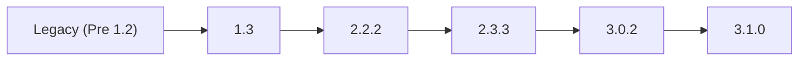
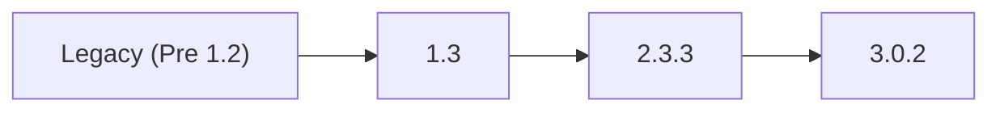

## TrueCommand 3.1.0

TrueCommand 3.1.0 builds on the foundation of previous releases, delivering the latest feature enhancements, improved system stability, and expanded software compatibility. This major update introduces new monitoring tools, configuration options, and quality-of-life improvements to make managing your TrueNAS systems even simpler.
Here are the major changes in this release:



* A brand new widget for Disk IOPs Reporting to provide real-time insight into system performance.

* New STARTTLS configuration options for Microsoft365 users to improve security and compatibility.
<--->
* Node.js version is updated from 20 to 22, ensuring a more efficient runtime environment for users.

* Snapshot task toggling is now available, granting greater flexibility in managing schedules snapshots.



## Obtaining the 3.1.0 Release

TrueCommand is primarily offered as a Software as a Service (SaaS) solution from iXsystems, but can be self-hosted as a container deployment.

TrueCommand Cloud registrations are available from https://portal.ixsystems.com.
A valid email address and credit card is required ([sign up instructions]()).

A self-hosted TrueCommand container is available from https://hub.docker.com/r/ixsystems/truecommand/tags under the tag **release-3.1.0** ([deployment instructions]()).

## 3.1.0 Upgrade Notes

TrueCommand Cloud deployments are upgraded automatically by TrueNAS. Self-hosted instances must be updated manually by a local TrueCommand administrator.

As a best practice, back up your instance data directory before deploying updates. Self-hosted containers are typically updated by backing up the container volume and pulling the latest available container version. See the [container update tutorial]() for guidance.

Migrating off of TrueCommand v2.3.3 or later does not require additional migration processes; however, migrating from any versions earlier than v2.3.3 requires a database migration process.

After upgrading to TrueCommand 3.1.0, you might need to edit and re-apply connected TrueNAS system passwords to ensure connectivity.

Starting in version 3.1.0, TrueCommand supports STARTTLS again to support availability for Microsoft365 users. 

Users can now enable or disable snapshot tasks directly, providing better control over scheduled backups.

Enhancements to CPU reporting and Disk IOPs reports provide more accurate system performance data.

A new NAS code dialog improves two-factor authentication workflows and temporary password resets for Cloud users are fixed.

Note that if you are using TrueCommand with a TrueNAS SCALE HA system, you need to update SCALE to version 23.10 or later before connecting to TrueCommand 3.1.0.

API key logins now fail and revoke the key, triggering a NAS alert. Users who are using a self-signed certificate might experience broken connections. It is advised to update your authentication settings prior to updating to TrueCommand 3.1.0 to avoid this disruption.

After updating, clear the browser cache (CTRL+F5) before logging in to TrueCommand. This ensures stale data does not interfere the TrueCommand UI.

### TrueNAS Compatibility

TrueCommand 3.1.0 is tested and compatible with these TrueNAS versions:

* 13.0
* 22.12
* 23.10
* 24.04
* 24.10
* 25.04

### 3.1.0 Paths

Self-hosted Containers:

## Release Schedule










## 3.1.0 Changelog

**March 11, 2025**

The TrueNAS team is pleased to release TrueCommand 3.1.0!

Notable changes:

* Dashboard averages percentages not space ([TC-3160](https://ixsystems.atlassian.net/browse/TC-3160))
* System group filtering broken on dashboard ([TC-3247](https://ixsystems.atlassian.net/browse/TC-3247))
* Retry connection after failover to ensure VIP has synced ([TC-3249](https://ixsystems.atlassian.net/browse/TC-3249))
* Create Disk IOPs Report ([TC-3255](https://ixsystems.atlassian.net/browse/TC-3255))
* API and admin login alerts are duplicated ([TC-3250](https://ixsystems.atlassian.net/browse/TC-3250))
* Fangtooth Compatibility ([TC-3263](https://ixsystems.atlassian.net/browse/TC-3263))
* Add STARTTLS config option ([TC-3242](https://ixsystems.atlassian.net/browse/TC-3242))
* Fix encryption usage for replication tasks ([TC-3281](https://ixsystems.atlassian.net/browse/TC-3281))
* Do not force update check to be successful for server initialization ([TC-3270](https://ixsystems.atlassian.net/browse/TC-3270))
* Close 2FA loophole ([TC-3278](https://ixsystems.atlassian.net/browse/TC-3278))
* Enable snapshot task toggling ([TC-3279](https://ixsystems.atlassian.net/browse/TC-3279))
* Add images of recent models ([TC-3254](https://ixsystems.atlassian.net/browse/TC-3254))
* Update container base from node 20->22, go 1.22-1.23 ([TC-3280](https://ixsystems.atlassian.net/browse/TC-3280))

<a href="https://ixsystems.atlassian.net/issues/?filter=11943" target="_blank">Click here for the full changelog</a> of completed tickets that are included in the TrueCommand 3.1.0 release.



### 3.1.0 Ongoing Issues


We recommend that TrueNAS Enterprise High Availability (HA) systems be updated from the TrueNAS UI.

If TrueCommand 3.1.0 is used to upgrade HA systems, the standby controller might fail to activate the updated boot environment, resulting in a version mismatch error between the controllers. If you encounter this issue, manually activate the updated boot environment on the active controller and then failover to complete the upgrade.


* The **Explore > Snapshots** tab can timeout when selected for datasets with high numbers of stored snapshots ([TC-3078](https://ixsystems.atlassian.net/browse/TC-3078)).

<a href="https://ixsystems.atlassian.net/issues/?filter=12008" target="_blank">Click here to see the latest Jira tickets</a> about known issues in 3.1.0 that are being resolved in a future TrueCommand release.

## TrueCommand 3.0

TrueCommand 3.0 brings the latest feature development, stability fixes, and software compatibility updates together in a major version that is more functional and performant than ever before.
Here are the major changes in this release:



* An all-new Fleet Dashboard provides at-a-glance information for every system connected to TrueCommand.

* New multi-system ZFS replication quickly backs up storage snapshots across connected TrueNAS systems.
<--->
* The experimental clustering feature is deprecated and UI screens disabled in TrueCommand 3.0.2.

* The experimental iSCSI management feature is permanently removed. iSCSI shares previously created by TrueCommand continue to live on the individual TrueNAS systems.



## Obtaining the 3.0 Release

TrueCommand is primarily offered as a Software as a Service (SaaS) solution from iXsystems, but can be self-hosted as a container deployment.

TrueCommand Cloud registrations are available from https://portal.ixsystems.com.
A valid email address and credit card is required ([sign up instructions]()).

A self-hosted TrueCommand container is available from https://hub.docker.com/r/ixsystems/truecommand/tags under the tag **release-3.0.2** ([deployment instructions]()).

## 3.0 Upgrade Notes

TrueCommand Cloud deployments are upgraded by iXsystems on an ongoing basis.
Please use caution when upgrading production TrueCommand systems.

Self-hosted containers must be updated by a local TrueCommand administrator.
As a best practice, TrueCommand administrators need to back up their instance data directory before deploying TrueCommand updates.
Self-hosted containers are typically updated by backing up the container volume and pulling the latest available container version.
See the [container update tutorial]() for guidance.

Updating from TrueCommand v1.3 to v2.0 or later involves a database migration process.
This preserves all configuration data, but does not preserve old performance statistics.
Additionally, it is not possible to roll back to TrueCommand v1.3 from v2.1 or later.

An issue is found with High Availability (HA) TrueNAS SCALE 23.10.0.1 systems connected to TrueCommand 3.0.
Update SCALE HA systems to TrueNAS SCALE version 23.10.1 or later before connecting to TrueCommand 3.0.

After upgrading to TrueCommand 3.0, you might need to edit and re-apply connected TrueNAS system passwords to ensure connectivity.

Starting in version 3.0.2, TrueCommand does not support STARTTLS or port 587 for SMTP email configuration.
Users with SMTP configured on port 587 should use port *465* and select **Enable TLS** for full SSL/TLS encryption.
See [Configuring SMTP Email]() for more information.

In version 3.0.2 administrative users no longer appear on the list of users available to be assigned to a team.
Administrative users have full admin permissions for all connected systems, so manual team assignment is not needed.

After updating, clear the browser cache (CTRL+F5) before logging in to TrueCommand. This ensures stale data does not interfere the TrueCommand UI.

### TrueNAS Compatibility

TrueCommand 3.0 is tested and compatible with these TrueNAS versions:

* 13.0
* 22.12
* 23.10
* 24.04
* 24.10
* 25.04

### Paths

Self-hosted Containers:

## 3.0.2 Changelog

**August 13, 2024**

iXsystems is pleased to release TrueCommand 3.0.2!

This is a maintenance release to address issues found in the 3.0.1 version.

Notable changes:

* Fix Cloud SMTP email configuration for authentication ([TC-3186](https://ixsystems.atlassian.net/browse/TC-3186)).
* Investigate detached NAS connections ([TC-3188](https://ixsystems.atlassian.net/browse/TC-3188)).
* Disable TrueNAS UI proxy ([TC-3190](https://ixsystems.atlassian.net/browse/TC-3190)).
* Do not try to decrypt text between 1 and 15 bytes ([TC-3198](https://ixsystems.atlassian.net/browse/TC-3198)).
* UI refreshes token too often ([TC-3200](https://ixsystems.atlassian.net/browse/TC-3200)).
* Job "config.save" does not finish and constantly yields error 32 ([TC-3202](https://ixsystems.atlassian.net/browse/TC-3202)).
* User alert creator status reset on migration ([TC-3177](https://ixsystems.atlassian.net/browse/TC-3177)).
* Stale sessions appear as active users ([TC-3180](https://ixsystems.atlassian.net/browse/TC-3180)).
* Enable HSTS on web server ([TC-3196](https://ixsystems.atlassian.net/browse/TC-3196)).
* Disable SWEET32 cipher suite support ([TC-3195](https://ixsystems.atlassian.net/browse/TC-3195)).
* Increase temp password timeout for Cloud to 48 hours ([TC-3187](https://ixsystems.atlassian.net/browse/TC-3187)).
* Do not check for upgrade_pending status if connected via the passive controller ([TC-3182](https://ixsystems.atlassian.net/browse/TC-3182)).
* Paused internal alerts do not persist past reboot ([TC-3181](https://ixsystems.atlassian.net/browse/TC-3181)).
* The deprecated Clusters screen has been disabled in the TrueCommand UI ([TC-3223](https://ixsystems.atlassian.net/issues/TC-3223))

<a href="https://ixsystems.atlassian.net/issues/?filter=10580" target="_blank">Click here for the full changelog</a> of completed tickets that are included in the TrueCommand 3.0.2 release.



### 3.0.2 Ongoing Issues


We recommend that TrueNAS Enterprise High Availability (HA) systems be updated from the TrueNAS UI.

If TrueCommand 3.0.2 is used to upgrade HA systems, the standby controller might fail to activate the updated boot environment, resulting in a version mismatch error between the controllers. If you encounter this issue, manually activate the updated boot environment on the active controller and then failover to complete the upgrade.


* The **Explore > Snapshots** tab can timeout when selected for datasets with high numbers of stored snapshots ([TC-3078](https://ixsystems.atlassian.net/browse/TC-3078)).

* Changes made to SMTP email configuration after initial setup might not apply for new users created after created after the configuration updates.
  If you have previously updated your SMTP configuration, create new user accounts as described in [Creating User Accounts]().
  Log in as the new user and review settings in **Alert Services > SMTP Email** to confirm they are correct.

* Removing all the systems from a group does not automatically delete the group. However, the system group is still manually removable.

<a href="https://ixsystems.atlassian.net/issues/?filter=10581" target="_blank">Click here to see the latest Jira tickets</a> about known issues in 3.0.2 that are being resolved in a future TrueCommand release.

## 3.0.1 Changelog


**March 12, 2024**

iXsystems is pleased to release TrueCommand 3.0.1!

This is a maintenance release to address issues found in the 3.0.0 version.

Notable changes:

* The **Legacy Dashboard** is now the default landing page ([TC-3145](https://ixsystems.atlassian.net/browse/TC-3145)).
* Further scrub passwords from audit logs and NAS user page ([TC-3134](https://ixsystems.atlassian.net/browse/TC-3134), [TC-3151](https://ixsystems.atlassian.net/browse/TC-3151).
* Alert level field in **Administration** settings does not update bugfix ([TC-3140](https://ixsystems.atlassian.net/browse/TC-3140)).
* NAS database backup pruning now reads the correct file time ([TC-3146](https://ixsystems.atlassian.net/browse/TC-3146)).
* NAS RRD metrics are now archived on deletion ([TC-3147](https://ixsystems.atlassian.net/browse/TC-3147)).

<a href="https://ixsystems.atlassian.net/issues/?filter=10509" target="_blank">Click here for the full changelog</a> of completed tickets that are included in the TrueCommand 3.0.1 release.



### 3.0.1 Ongoing Issues


We recommend that TrueNAS Enterprise High Availability (HA) systems be updated from the TrueNAS UI.

If TrueCommand 3.0.1 is used to upgrade HA systems, the standby controller might fail to activate the updated boot environment, resulting in a version mismatch error between the controllers. If you encounter this issue, manually activate the updated boot environment on the active controller and then failover to complete the upgrade.


* The **Explore > Snapshots** tab can timeout when selected for datasets with high numbers of stored snapshots ([TC-3078](https://ixsystems.atlassian.net/browse/TC-3078)).

<a href="https://ixsystems.atlassian.net/issues/?filter=10510" target="_blank">Click here to see the latest Jira tickets</a> about known issues in 3.0.1 that are being resolved in a future TrueCommand release.


## 3.0.0 Changelog


**December 19, 2023**

iXsystems is pleased to release TrueCommand 3.0.0!

Notable changes:

* **Fleet Dashboard** improvements ([TC-3076](https://ixsystems.atlassian.net/browse/TC-3076) and [TC-3075](https://ixsystems.atlassian.net/browse/TC-3075)).
* Audit logs are updated to protect potentially sensitive user information by excluding certain fields ([TC-3012](https://ixsystems.atlassian.net/browse/TC-3012)).
* The **Administration** page allows configuring when idle user account sessions are automatically timed out.
* TrueCommand 3.0 has not passed validation for Clustering and that feature is expected to be highly unstable in this release.
  With the current unmaintained state of the upstream Gluster project, consider this functionality deprecated.
  The clustering feature is scheduled for removal in a future TrueCommand revision.

<a href="https://ixsystems.atlassian.net/issues/?filter=10433" target="_blank">Click here for the full changelog</a> of completed tickets that are included in the TrueCommand 3.0.0 release.



### 3.0.0 Ongoing Issues

<a href="https://ixsystems.atlassian.net/issues/?filter=10434" target="_blank">Click here to see the latest Jira tickets</a> about issues discovered in 3.0.0 that are being resolved in a future TrueCommand release.


## 3.0.0-BETA.1 Changelog




Early releases are intended for testing and feedback purposes only.
Do not use early release software for mission critical tasks.


**November 9, 2023**

iXsystems is pleased to release TrueCommand 3.0.0-BETA.1!
This is the first public release of TrueCommand 3.0 for early testing and review of features included in this major version.

Notable changes:
* Allow reusing IP address/hostname for TrueNAS connections ([TC-2672](https://ixsystems.atlassian.net/browse/TC-2672)).
* Additional warnings on cluster feature ([TC-2630](https://ixsystems.atlassian.net/browse/TC-2630))
* Default ports updated: 443 on TrueCommand Cloud deployments and 80 on self-hosted containers ([TC-2573](https://ixsystems.atlassian.net/browse/TC-2573))
* Bug fixes for SAML user creation ([TC-2532](https://ixsystems.atlassian.net/browse/TC-2532))
* Polish update availability notices on system cards ([TC-2511](https://ixsystems.atlassian.net/browse/TC-2511))

<a href="https://ixsystems.atlassian.net/issues/?filter=10418" target="_blank">Click here for the full changelog</a> of completed tickets that are included in the TrueCommand 3.0.0-BETA.1 release.



### 3.0.0-BETA.1 Ongoing Issues

<a href="https://ixsystems.atlassian.net/issues/?filter=10419" target="_blank">Click here to see the latest Jira tickets</a> about issues discovered in 3.0.0-BETA.1 that are being resolved in a future TrueCommand release.

