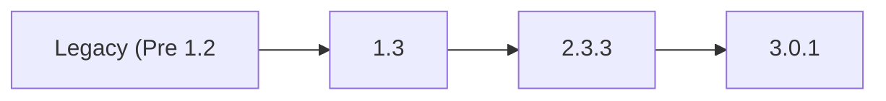

TrueCommand 3.0 brings the latest feature development, stability fixes, and software compatibility updates together in a major version that is more functional and performant than ever before.
Here are the major changes in this release:



* An all-new Fleet Dashboard provides at-a-glance information for every system connected to TrueCommand.

* New multi-system ZFS replication quickly backs up storage snapshots across connected TrueNAS systems.
<--->
* The experimental clustering feature is deprecated and scheduled for removal in a future TrueCommand version.

* The experimental iSCSI management feature is permanently removed. iSCSI shares previously created by TrueCommand continue to live on the individual TrueNAS systems.



## Obtaining the Release

TrueCommand is primarily offered as a Software as a Service (SaaS) solution from iXsystems, but can be self-hosted as a container deployment.

TrueCommand Cloud registrations are available from https://portal.ixsystems.com.
A valid email address and credit card is required ([signup instructions]()).

A self-hosted TrueCommand container is available from https://hub.docker.com/r/ixsystems/truecommand/tags under the tag **release-3.0.1** ([deployment instructions]()).

## Upgrade Notes

TrueCommand Cloud deployments are upgraded by iXsystems on an ongoing basis.
Please use caution when upgrading production TrueCommand systems.

Self-hosted containers must be updated by a local TrueCommand administrator.
As a best practice, TrueCommand administrators need to back up their instance data directory before deploying TrueCommand updates.
Self-hosted containers are typically updated by backing up the container volume and pulling the latest available container version.
See the [container update tutorial]() for guidance.

Updating from TrueCommand v1.3 to v2.0 or later involves a database migration process.
This preserves all configuration data, but does not preserve old performance statistics.
Additionally, it is not possible to roll back to TrueCommand v1.3 from v2.1 or later.

An issue is found with High Availability (HA) TrueNAS SCALE 23.10.0.1 systems connected to TrueCommand 3.0.0-BETA.1.
Update SCALE HA systems to TrueNAS SCALE version 23.10.1 or later before connecting to TrueCommand 3.0.

After upgrading to TrueCommand 3.0, you might need to edit and re-apply connected TrueNAS system passwords to ensure connectivity.

### TrueNAS Compatibility

TrueCommand 3.0 is tested and compatible with these TrueNAS versions:

* CORE 13.0
* SCALE 22.12
* SCALE 23.10 - High Availability systems are not yet fully supported.

### Paths

Self-hosted Containers:

## Release Schedule










## 3.0.1 Changelog

**March 7, 2024**

iXsystems is pleased to release TrueCommand 3.0.1!

This is a maintenance release to address issues found in the 3.0.0 version.

Notable changes:

* The **Legacy Dashboard** is now the default landing page ([TC-3145](https://ixsystems.atlassian.net/browse/TC-3145)).
* Further scrub passwords from audit logs and NAS user page ([TC-3134](https://ixsystems.atlassian.net/browse/TC-3134), [TC-3151](https://ixsystems.atlassian.net/browse/TC-3151).
* Alert level field in **Administration** settings does not update bugfix ([TC-3140](https://ixsystems.atlassian.net/browse/TC-3140)).
* NAS database backup pruning now reads the correct file time ([TC-3146](https://ixsystems.atlassian.net/browse/TC-3146)).
* NAS RRD metrics are now archived on deletion ([TC-3147](https://ixsystems.atlassian.net/browse/TC-3147)).

<a href="https://ixsystems.atlassian.net/issues/?filter=10509" target="_blank">Click here for the full changelog</a> of completed tickets that are included in the TrueCommand 3.0.1 release.



### 3.0.1 Ongoing Issues


When TrueCommand 3.0.1 is used to upgrade TrueNAS Enterprise High Availability (HA) systems, the standby controller might fail to activate the updated boot environment, resulting in a version mismatch error between the controllers. If you encounter this issue, manually activate the updated boot environment on the active controller and then failover to complete the upgrade.


* The **Explore > Snapshots** tab can timeout when selected for datasets with high numbers of stored snapshots ([TC-3078](https://ixsystems.atlassian.net/browse/TC-3078)).

<a href="https://ixsystems.atlassian.net/issues/?filter=10510" target="_blank">Click here to see the latest Jira tickets</a> about known issues in 3.0.1 that are being resolved in a future TrueCommand release.

## 3.0.0 Changelog


**December 19, 2023**

iXsystems is pleased to release TrueCommand 3.0.0!

Notable changes:

* **Fleet Dashboard** improvements ([TC-3076](https://ixsystems.atlassian.net/browse/TC-3076) and [TC-3075](https://ixsystems.atlassian.net/browse/TC-3075)).
* Audit logs are updated to protect potentially sensitive user information by excluding certain fields ([TC-3012](https://ixsystems.atlassian.net/browse/TC-3012)).
* The **Administration** page allows configuring when idle user account sessions are automatically timed out.
* TrueCommand 3.0 has not passed validation for Clustering and that feature is expected to be highly unstable in this release.
  With the current unmaintained state of the upstream Gluster project, consider this functionality deprecated.
  The clustering feature is scheduled for removal in a future TrueCommand revision.

<a href="https://ixsystems.atlassian.net/issues/?filter=10433" target="_blank">Click here for the full changelog</a> of completed tickets that are included in the TrueCommand 3.0.0 release.



### 3.0.0 Ongoing Issues

<a href="https://ixsystems.atlassian.net/issues/?filter=10434" target="_blank">Click here to see the latest Jira tickets</a> about issues discovered in 3.0.0 that are being resolved in a future TrueCommand release.


## 3.0.0-BETA.1 Changelog




Early releases are intended for testing and feedback purposes only.
Do not use early release software for mission critical tasks.


**November 9, 2023**

iXsystems is pleased to release TrueCommand 3.0.0-BETA.1!
This is the first public release of TrueCommand 3.0 for early testing and review of features included in this major version.

Notable changes:
* Allow reusing IP address/hostname for TrueNAS connections ([TC-2672](https://ixsystems.atlassian.net/browse/TC-2672)).
* Additional warnings on cluster feature ([TC-2630](https://ixsystems.atlassian.net/browse/TC-2630))
* Default ports updated: 443 on TrueCommand Cloud deployments and 80 on self-hosted containers ([TC-2573](https://ixsystems.atlassian.net/browse/TC-2573))
* Bug fixes for SAML user creation ([TC-2532](https://ixsystems.atlassian.net/browse/TC-2532))
* Polish update availability notices on system cards ([TC-2511](https://ixsystems.atlassian.net/browse/TC-2511))

<a href="https://ixsystems.atlassian.net/issues/?filter=10418" target="_blank">Click here for the full changelog</a> of completed tickets that are included in the TrueCommand 3.0.0-BETA.1 release.



### 3.0.0-BETA.1 Ongoing Issues

<a href="https://ixsystems.atlassian.net/issues/?filter=10419" target="_blank">Click here to see the latest Jira tickets</a> about issues discovered in 3.0.0-BETA.1 that are being resolved in a future TrueCommand release.

