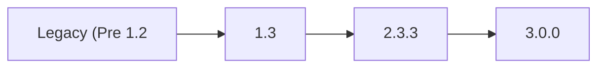

<!-- Remove the TC 3.0 release notes alias when the version branch publishes with 3.0.0 -->




The latest [TrueCommand **stable** version release notes](https://www.truenas.com/docs/truecommand/2.3/tcgettingstarted/tcreleasenotes/) are now available from the TrueCommand 2.3 section of the Documentation Hub.


## TrueCommand 3.0

TrueCommand 3.0 brings the latest feature development, stability fixes, and software compatability updates together in a major version that is more functional and performant than ever before.
Here are the major features of this release:



* An all-new Fleet Dashboard provides at-a-glance information for every system connected to TrueCommand.

* New multi-system ZFS replication quickly backs up storage snapshots from many to a single system. (Coming soon!)
<--->
* The Clusters experimental feature is being re-evaluated. This feature in TrueCommand 3.0 is available for non-production environments and feature research only.

* The experimental iSCSI management feature is permanently removed. iSCSI shares previously created by TrueCommand continue to live on the individual TrueNAS systems.



## Obtaining the Release

TrueCommand is primarily offered as a Software as a Service (SaaS) solution from iXsystems, but can be self-hosted as a container deployment.

TrueCommand Cloud registrations are available from https://portal.ixsystems.com.
A valid email address and credit card is required ([signup instructions]()).

A self-hosted TrueCommand container is available from https://hub.docker.com/r/ixsystems/truecommand/tags under the tag **3.0.0-BETA.1** ([deployment instructions]()).

## Upgrades
TrueCommand Cloud deployments are upgraded by iXsystems on an ongoing basis.

Self-hosted containers must be updated by a local TrueCommand administrator.
As a best practice, TrueCommand administrators need to back up their instance data directory before deploying TrueCommand updates.
Self-hosted containers are typically updated by backing up the container volume and pulling the latest available container version.
See the [container update tutorial]() for guidance.

Updating from TrueCommand v1.3 to v2.0 or newer involves a database migration process.
This preserves all configuration data, but does not preserve old performance statistics.
Additionally, it is not possible to roll back to TrueCommand v1.3 from v2.1.

Please use caution when upgrading production TrueCommand systems.
If necessary, run TrueCommand 1.3 and TrueCommand 2.1 in parallel for a transition period.
Use the “ixsystems/truecommand:1.3.2” container image to continue using that specific version of TrueCommand.

An issue is found with High Availability (HA) TrueNAS SCALE 23.10.0.1 systems connected to TrueCommand 3.0.0-BETA.1.
Avoid connecting a SCALE HA system to TrueCommand 3.0.0 until it is updated to TrueNAS SCALE version 23.10.1 or later.

### TrueNAS Compatibility

TrueCommand 3.0 is tested and compatible with these TrueNAS versions:

* CORE 13.0
* SCALE 22.12
* SCALE 23.10 - High Availability systems are not yet fully supported.

### Paths

Self-hosted Containers:

## 3.0.0-BETA.1 Changelog


Early releases are intended for testing and feedback purposes only.
Do not use early release software for mission critical tasks.


**November 9, 2023**

iXsystems is pleased to release TrueCommand 3.0.0-BETA.1!
This is the first public release of TrueCommand 3.0 for early testing and review of features included in this major version.

Notable changes:
* Allow reusing IP address/hostname for TrueNAS connections ([TC-2672](https://ixsystems.atlassian.net/browse/TC-2672)).
* Additional warnings on cluster feature ([TC-2630](https://ixsystems.atlassian.net/browse/TC-2630))
* Default ports updated: 443 on TrueCommand Cloud deployments and 80 on self-hosted containers ([TC-2573](https://ixsystems.atlassian.net/browse/TC-2573))
* Bug fixes for SAML user creation ([TC-2532](https://ixsystems.atlassian.net/browse/TC-2532))
* Polish update availability notices on system cards ([TC-2511](https://ixsystems.atlassian.net/browse/TC-2511))

<a href="https://ixsystems.atlassian.net/issues/?filter=10418" target="_blank">Click here for the full changelog</a> of completed tickets that are included in the TrueCommand 3.0.0-BETA.1 release.



### 3.0.0-BETA.1 Ongoing Issues

<a href="https://ixsystems.atlassian.net/issues/?filter=10419" target="_blank">Click here to see the latest Jira tickets</a> about issues discovered in 3.0.0-BETA.1 that are being resolved in a future TrueCommand release.
