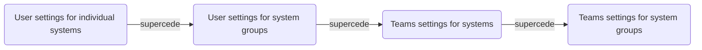

&NewLine;
Because it is possible to configure multiple permissions for the same user account and system in different areas, TrueCommand follows a hierarchy to determine which permission settings control the account.

For example, user **A** is configured to have direct read and write access to system **1**.
This permission remains in place, even if user **A** joins a team that only has read permission for system **1**.
