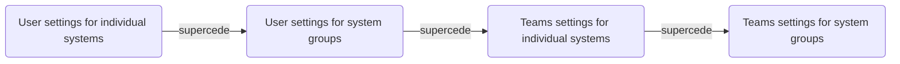

&NewLine;
Different TrueCommand screes allow you to configure multiple permissions for the same user account and system.
When this happens, TrueCommand follows a specific flow to determine which permission settings control the account:

For example, user *A* is configured to have direct read and write access to system *1*.
This permission remains in place, even if user *A* joins a TrueCommand team that is configured with read permission for system *1*.

When a user account has multiple permissions at the same level (user is a member of two teams that have different permissions to the same system), TrueCommand defaults to granting the user account the most permissive option between the conflicting permissions.
