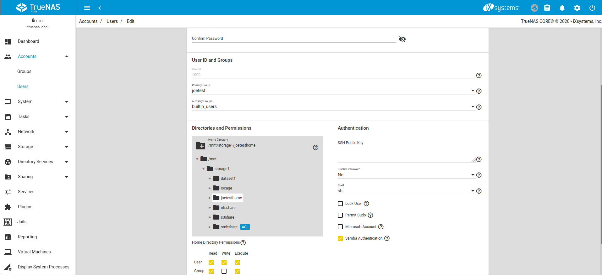
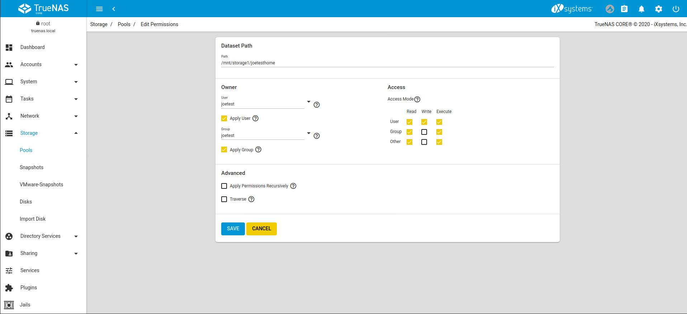
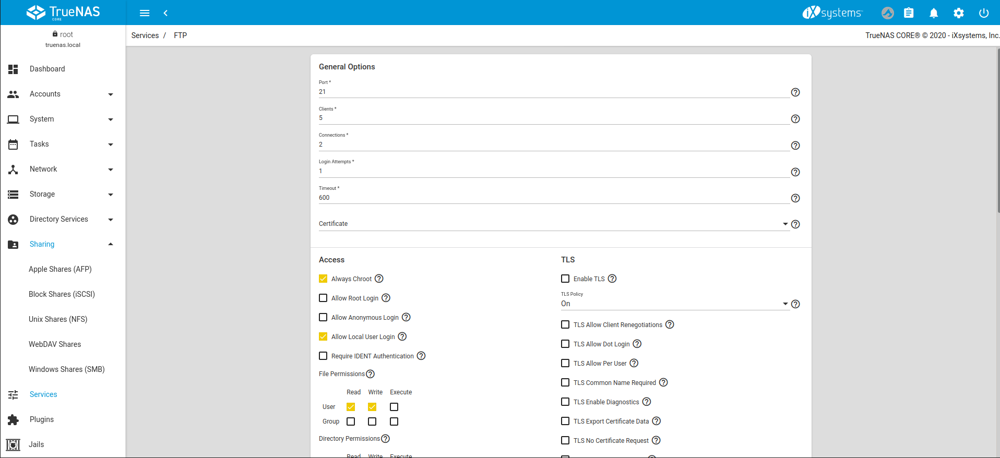
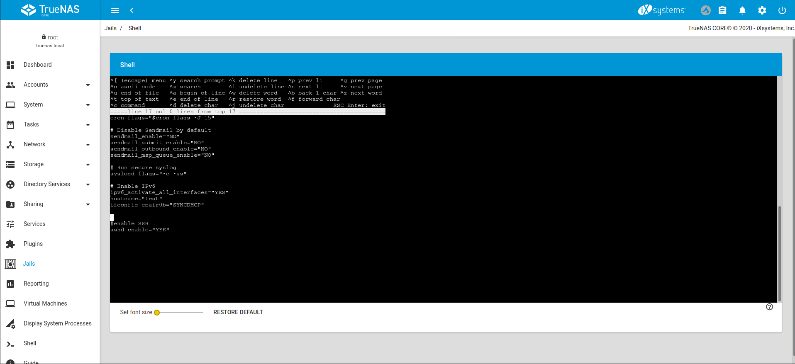

## FTP on TrueNAS

FTP is available in the services section of TrueNAS. 

Create a dataset for the FTP service under **Storage**. 

Create a local user on the TrueNAS and assign a user name, password, and assign the newly created dataset for the FTP share as the home directory of the user. This can be done on a per user basis, or a global account for the FTP could also be created, for example OurOrgFTPacnt, etc.

Return to **Storage** and click on the three dot menu of the new dataset. Click **Edit permissions**. Set the dataset owner (user and group) to the newly created user account. Be sure to click **Apply User** and **Apply Group** before saving.

Go to **Services** -> **FTP** and click on the **Configure** icon.

Choose whether to adjust the default options of port number, max number of clients, connections, login attempts, and timeout. Port 21 is the default for FTP, 22 for SFTP.

Click advanced, ensure chroot is enabled (this helps confine FTP sessions to a local user's home directory) and allow **Local User Login**. Unless necessary, do NOT allow anonymous or root access. For better security, recommend enabling TLS if able - effectively FTPS. TLS definitely should be enabled if the FTP service is to be exposed to a WAN.

Using a browser or FTP client, such as FileZilla, connect to the TrueNAS FTP share. Note the user name and password are those of the local user account on the TrueNAS itself. The default directory is the same as the user's /home directory. Directories can be created and files uploaded and downloaded.

## SFTP on TrueNAS

SFTP or SSH File Transfer Protocol, is available by enabling SSH remote access to the TrueNAS system. SFTP is more secure than standard FTP as it applies SSL encryption on all transfers by default.

Go to **Services** -> **SSH** and click on the **Configure** icon.

Check to ensure password authentication is allowed. Choose whether to allow root access. Remember that SSH with root allows full remote control over the NAS via a terminal, not just SFTP transfer access. 

Similar to the FTP setup, open FileZilla or another FTP client, or command line. Using FileZilla enter **SFTP://'TrueNAS IP'**, **'username'**, **'password'**, and port **22** to connect. 

Note: SFTP does not have chroot locking. While chroot is not 100% secure, the lack of chroot allows users to easily move up to the root directory and view internal system information. If this level of access is a concern, FTPS may be the more secure choice.

## SFTP in a TrueNAS Jail

Another way allow SFTP access without granting read access to other areas of the NAS itself is to set up a jail and enable SSH.

Go to **Jails** -> **Add**. Provide a name for the jail and pick a target FreeBSD image. 11.3 was used for the purpose of this guide.

Set the networking settings - either DHCP or static IP - and confirm to create. 

After creation open the menu by clicking the expand icon **<** on the right-hand side of the jail. Click **START** and open the **SHELL**. 

Similar to the initial FTP setup, create a user in the jail. Type **adduser** and follow the fields including the password and home directory location. Once filled in the system will ask to confirm the credentials.

Enable SSH by editing the /etc/rc.conf file. Type **vi /etc/rc.conf** or **ee /etc/rc.conf** depending on preference, add **sshd_enable = "YES"** to the file, save, and exit. Type **service sshd enabled** to enable the service (enabled vs start indicates whether sshd will start once or on every reboot). 

Using an FTP client, such as FileZilla, log in with the jail IP address and user credentials. Like with SSH on TrueNAS, browsing to other folders and locations beyond the user's home directory is possible, but unlike running on TrueNAS directly, only the components of the jail are available.

### TFTP on TrueNAS

Trivial File Transfer Protocol (TFTP) is a light-weight version of FTP typically used to transfer configuration or boot files between machines, such as routers, in a local environment. TFTP provides an extremely limited set of commands and provides no authentication.

If the TrueNAS® system will be used to store images and configuration files for network devices, configure and start the TFTP service. Starting the TFTP service opens UDP port 69.

The TFTP configuration screen 

  

TFTP Configuration available options

| Setting          | Value          | Description                                                                                                                                            |
|------------------|----------------|--------------------------------------------------------------------------------------------------------------------------------------------------------|
| Directory        | Browse button  | Browse to an existing directory to be used for storage. Some devices require a specific directory name, refer to the device documentation for details. |
| Allow New Files  | checkbox       | Set when network devices need to send files to the system. For example, to back up their configuration.                                                |
| Host             | IP address     | The default host to use for TFTP transfers. Enter an IP address. Example: 192.0.2.1.                                                                   |
| Port             | integer        | The UDP port number that listens for TFTP requests. Example: 8050.                                                                                     |
| Username         | drop-down menu | Select the account to use for TFTP requests. This account must have permission to the `Directory`.                                                       |
| File Permissions | checkboxes     | Set permissions for newly created files. The default is everyone can read and only the owner can write. Some devices require less strict permissions.  |
| Extra options    | string         | Add more options from [tftpd(8)](https://www.freebsd.org/cgi/man.cgi?query=tftpd) Add one option on each line.                             

